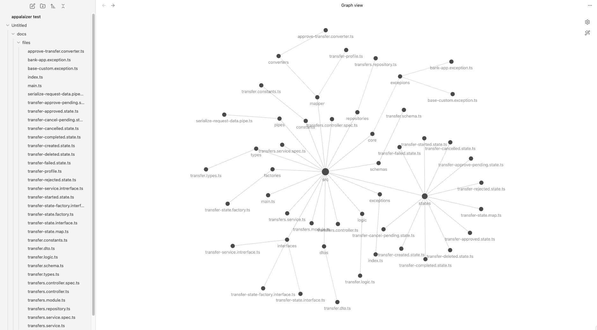
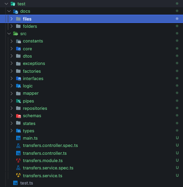

# Appalaizer


Appalaizer is an NPM package designed to optimize your development processes by analyzing the structure and relationships within your projects. It allows you to deeply examine your file and folder structures, generate Markdown documentation suitable for Obsidian, and obtain understandable explanations over your code content with AI-powered analysis.

- Appalaizer uses openai services.

- Appalaizer is an open source project.

## Features

- **Project Tree Generator:** Turns your project's file and folder structure into a visual tree.
- **Markdown Documentation:** Automatically generates Markdown documents compatible with Obsidian.
- **AI-Powered Analysis:** Analyzes your code using OpenAI's GPT models.
- **Interactive CLI:** Offers an easy-to-use command-line interface.
- **Flexible and Extensible:** Compatible with various project structures and languages.
- **Global Scope (Not only nodejs project):** It can be used in any environment where nodejs and npm are installed. If installed globally, it can be used with bash commands from the terminal. In other words, it provides file and directory analysis in general scope.

## About Appalaizer

- **Best Use Cases:** 
  - The Appalaizer package is designed to be suitable for popular note-taking applications. For example, if the created docs file is transferred directly to a value in Obsidian, the folder map will work directly. This allows examining your application's analysis files and visualizing the relationship between them.
  
  - It is suitable to be used in cases where complex structures can be explained in their simplest form by creating timely AI-based analyzes in files containing complex structures, and promts will be developed in this direction in future versions.

  - It creates a folder named docs in the directory where it runs and saves the md files created without the analysis preference or this option. This allows you to analyze the files that will be added to the relevant directory in other languages ​​as long as you are in the node.js environment, **but it is your responsibility to benefit from this service in accordance with your own language and structure**.

  ***(For example, if you add a Python directory to your project to analyze a file in an environment where you are working with TypeScript and try to compile the TypeScript in the directory where the file is located, you will receive an error due to language incompatibility. In this case, if you want to analyze without compiling, you will not have a problem, etc.)***


***Get this,***

 

***from this:***

 


- **Logic:** The Appalyzer package creates a tree structure of the directory in which it is run, and creates markdown (.md) files with the contents of the files in each folder in this tree, with services designed according to need, and uses Openai engines according to your preferences, with pre-defined and under-developed prompts, and It always keeps the engines you want to use up to date from the source, analyzes them according to the engine you choose and the preferred languages, and writes them into the created markdown (.md) files.

## Usage

***After installing Appalaizer, you can run it from the command line in the root directory of your project:***


- Creates markdowns of all source directorys structure and generates ai-based documentation
```sh
appalaizer --analyze
```
```sh 
apl --analyze
```


- Lists all available commands in appalaizer package
```sh
appalaizer --list
```
```sh
apl --list
```


- Creates only md files as structure (faster but there will be no analysis.):
```sh
appalaizer --md 
```
```sh
apl --md 
```


- Sets openai api key of package:
```sh
appalaizer --api-key 
```
```sh
apl --api-key 
```


## Support & Contact and Contribution

For your problems or suggestions, you can contact us via [GitHub issues](https://github.com/berkcansavur/appalaizer/issues).

## Installation

Add Appalaizer to your project by using NPM

```sh
npm install appalaizer 
```

Or Add Appalaizer globally by using NPM

```sh
npm install -g appalaizer 
```

